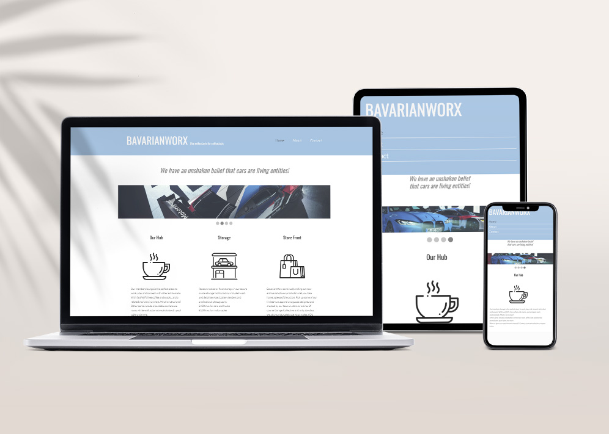
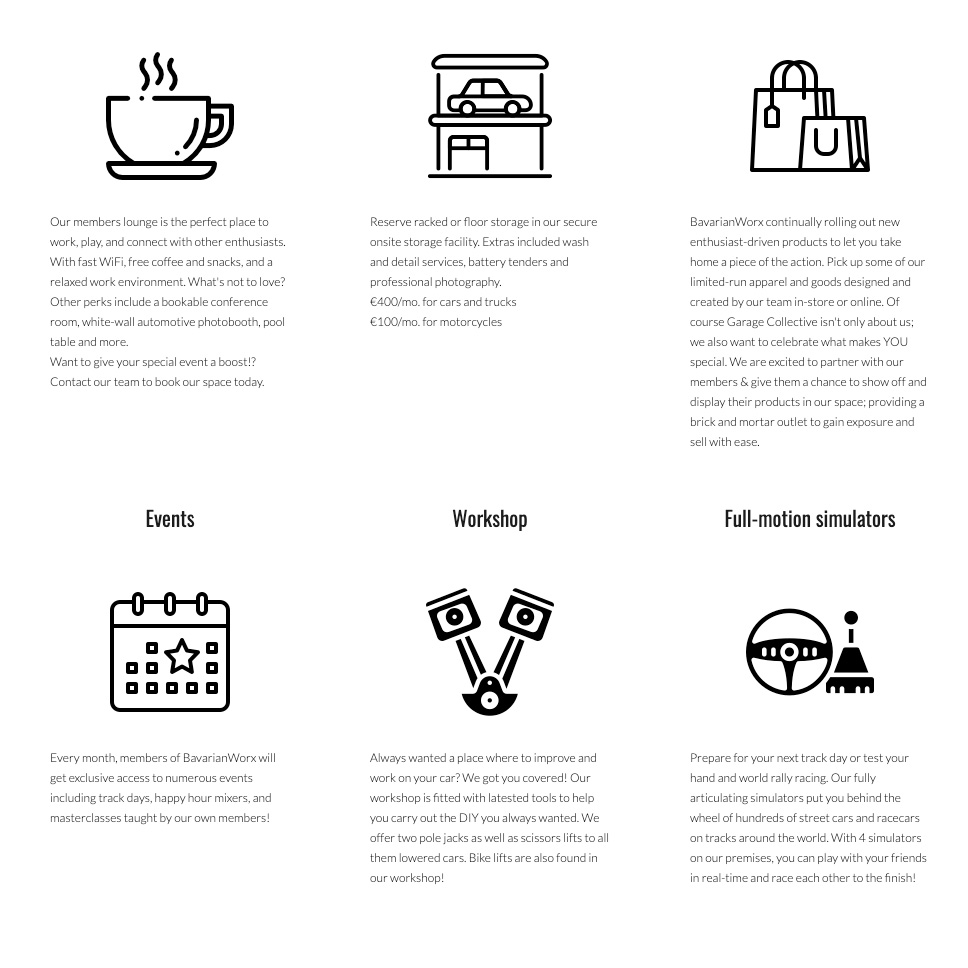
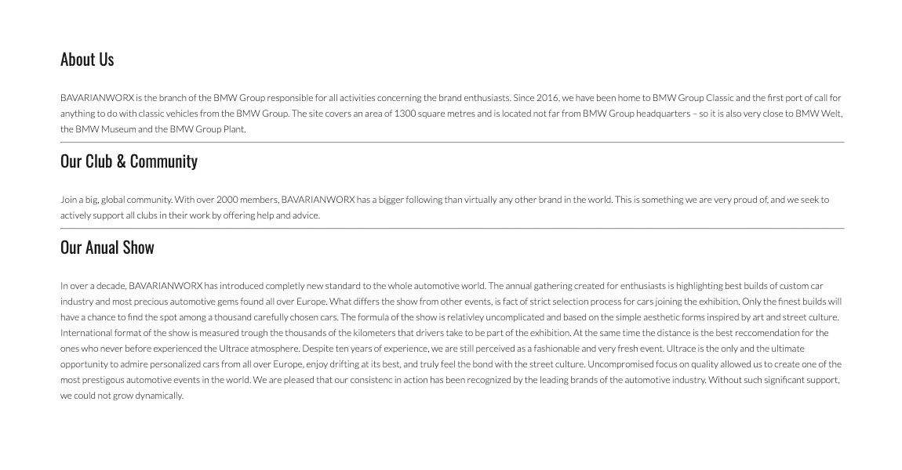
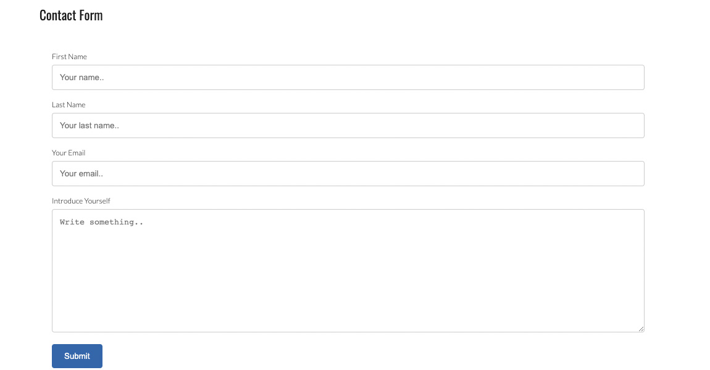

 

## **Welcome to BavarianWorx**

 

BavarianWorx is is a club for the automobile community.

Its initiation was to gather the motor community and offer a place were enthusiats can meet, work on their projects, share their knowledge and help one another.

The website will target the 1000's of enthusiats around the country and world who share the same passion

 

### Features

#### Existing Features

1. Navigation Bar
***
    * The same navigation bar is featured on all page and it is placed in the same location. 
    * This makes it easy for the user to navigate the website.
    * There are 3 links to 3 diffrent pages, Home, About and Contacts page.

 

2. Club Ethos
***
    * This section allows the members to see the benefits of joining your club.
    * Six benefits of becomeing a members are outlined to encourge them to sign up.
 
 

3. About Us
***
    * A short summary on the history of the club can be found by the user.

 

4. Contact
***
    * On the contact page the user has the option of getting in touch and ask for more information from the club.

 

5. Footer
***
    
    * In the footer the user came find links to the club social media accounts.

 
#### Features Left to Implement

* Form submit php code
* Booking form

### Testing

The website isnt too complex in order to allow all users to browse across different platform. All section and pages are responsive and can be accessed on mobile, tables and web browsers.

The images have been kept to a reasonable size to speed up the page loading but still offer a high end finish.

 

### Validator Testing

1. HTML
    -No errors were returned when passing through the official W3C validator https://validator.w3.org/
2. CSS
    -No errors were found when passing through the official (Jigsaw) validator https://jigsaw.w3.org/css-validator/
 

### Deployment

The site was deployed to GitHub pages. The steps to deplay are as fallows:

        
        - In the GitHub repository, navigate to the settings tab
        - From the source section drop-down menu, select Master Branch
        - Once the master branch has been selected, the page will be automatically refreshed with a detailed ribbon display to indicate the successful deployment.

The live link can be found here - https://cristiandramu.github.io/carclub/

### Credits
This website wouldnt be possible to come to live without the help of the onlone community.
#### Media
* Images for the slider are made avaliable by www.bmw-motorsport.com
* Icons on homemade can be found on www.flaticon.com 

#### Coding

* Slider was made avaliable with tanks to www.w3schools.com
* Online coding community and slack was also helpfull with debugging and getting the coding correct.